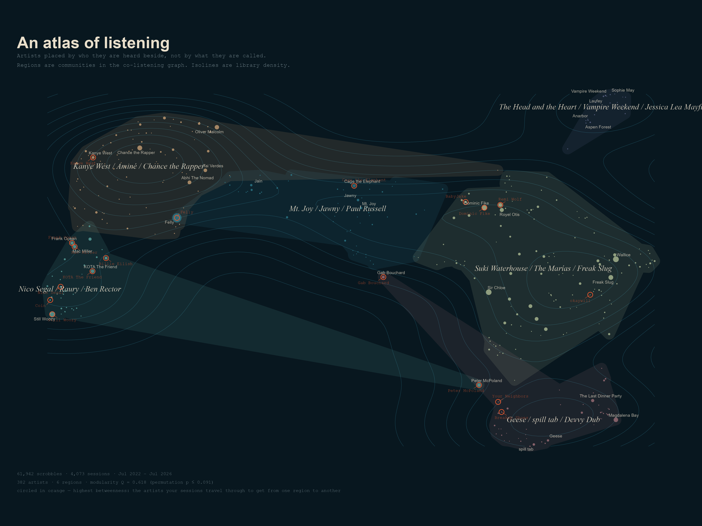

# Soundings

Artists positioned by **who you hear them beside**, not by what anyone calls them.

A Last.fm listening history gets turned into a taste-space embedding and rendered as an interactive map — regions of the map are communities of artists that actually show up together in real sessions, not genre labels.

**[Open the live app →](https://vincentrupp1.shinyapps.io/ArtistSimilarity/)**
Also deployed for a second listener: **[curtisschaefer's Soundings →](https://vincentrupp1.shinyapps.io/soundings-curtisschaefer/)**



## What it does

For each account, `01_build_taste_space.R` builds a picture of listening from co-occurrence, not metadata: which artists actually turn up next to each other inside real sessions. That structure gets compressed into a 128-dimensional embedding, clustered into regions, and projected down to 2D for the interactive map in `03_app.R`. `02_atlas_plots.R` renders static summary plots like the one above.

| step | what | why |
|---|---|---|
| sessionise | 30-min gap splits the scrobble stream | a session is one listening context |
| co-occurrence | ±5 scrobbles, weight 1/distance | adjacency, not just same-day |
| PPMI | context smoothing α = 0.75 | stops big artists dominating every context |
| SVD | 128 dims, eigenvalues weighted S^0.5 | Levy & Goldberg (2014): SVD of shifted PPMI is the matrix-factorisation equivalent of skip-gram with negative sampling |
| Leiden | on the cosine kNN graph | communities, tested against a permutation null |
| UMAP | 2-D, cosine metric | **display only** — every number in the app comes from the 128-d space |

The null shuffles artist labels across the whole scrobble sequence. Play counts and session lengths stay exactly as they are; only *who sits next to whom* is destroyed. If observed modularity doesn't clear that, the regions aren't real.

## Reading the app

**Bridge** (betweenness) — artists your sessions travel *through*. High bridge with modest play counts is the interesting case: connective tissue, not favourites.

**Context spread** (normalised entropy of the surrounding regions) — low means you only ever hear them one way; high means they show up everywhere. An artist that's high on both bridge and spread is doing real work in your listening.

**Bearings** tab — pick any two artists as poles and every artist in the library gets a coordinate on the line between them. Pick poles that are far apart *in the map* and the axis will be interpretable; pick near-neighbours and you get noise.

**Currents** — co-occurrence is symmetric but playback isn't. The heatmap is log2(observed / expected under independence), so it shows moves you make more than chance rather than moves between your two biggest regions.

`plots/02_drift.png` shows the same map with a play-weighted centroid drawn across years — where the "center of gravity" of a listener's taste has actually moved over time.

## Running it yourself

```r
install.packages(c("Matrix","irlba","igraph","uwot","ggplot2","ggforce","ggrepel",
                   "plotly","shiny","circlize","jsonlite","showtext","sysfonts"))

# put scrobbles at data/scrobbles.csv  (artist, track, timestamp)
# or set CFG$fetch <- TRUE with LASTFM_USER and LASTFM_API_KEY in your environment

Rscript 01_build_taste_space.R     # minutes; writes taste_space.rds
Rscript 02_atlas_plots.R           # writes plots/*.png
Rscript -e "shiny::runApp('03_app.R')"
```

### Knobs worth turning

- `window` — 3 is "the next few tracks", 10 is "this evening's mood"
- `leiden_res` — above 1 splits regions finer, below 1 merges them
- `session_gap_min` — 15 for tighter contexts, 60 if you leave music running
- `min_plays` / `max_artists` — the long tail is noisy; 25/1500 is a sane floor
- `fetch_tags = TRUE` — labels regions by TF-IDF-distinctive tags instead of by their most typical artists. Adds one API call per artist. Worth it once.

## Stack

R · Last.fm API · Matrix/irlba (PPMI + SVD) · igraph (Leiden) · uwot (UMAP) · Shiny · shinyapps.io
